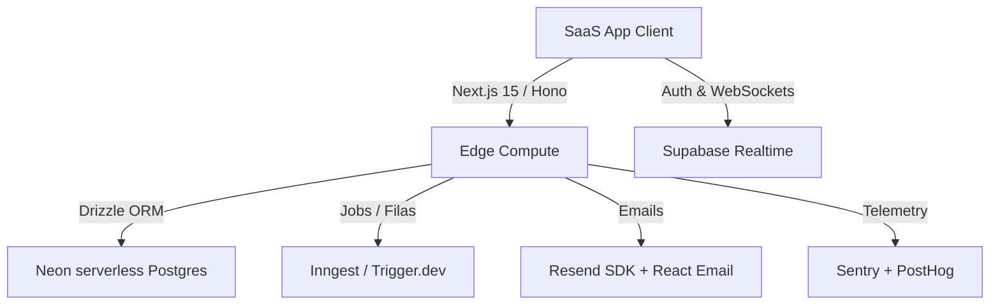

# 🚀 Enterprise SaaS Agentic Skills Repository

[](https://github.com/resper1965/skills)
[](https://orm.drizzle.team)
[](https://nextjs.org)
[](https://owasp.org)

Este repositório contém uma coleção curada de **Skills Agenticas de Nível Enterprise** focadas em desenvolvimento, arquitetura, segurança e observabilidade de sistemas SaaS modernos.

Cada skill foi projetada para ensinar agentes de IA (como **Claude Code CLI**, **Cursor**, **Gemini CLI** e **Antigravity**) as regras de negócio, convenções de código e workflows de segurança específicos do seu stack.

---

## 🛠️ Tecnologias Cobertas



---

## 📂 Catálogo Completo de Skills (13 Skills)

Este repositório contém a documentação e playbooks para **13 skills** fundamentais do ecossistema:

| Nome da Skill | Objetivo e Escopo | Triggers Recomendados |
| :--- | :--- | :--- |
| [🔗 neon-branching-workflow](skills/neon-branching-workflow/SKILL.md) | Gerenciar Preview Databases por PR no Neon Postgres. | `@neon-branching-workflow`, "preview database", "neon branches" |
| [🔗 stack-conventions](skills/stack-conventions/SKILL.md) | Padronizar convenções de Next.js 15, Drizzle, Hono e fp-ts. | `@stack-conventions`, "convenções do stack", "padrão de projeto" |
| [🔗 saas-launch-checklist](skills/saas-launch-checklist/SKILL.md) | Checklist de deploy em produção (Performance, Segurança, Ops). | `@saas-launch-checklist`, "launch checklist", "produção" |
| [🔗 zero-downtime-migrations](skills/zero-downtime-migrations/SKILL.md) | Migrações Postgres seguras (`lock_timeout`, `CONCURRENTLY`). | `@zero-downtime-migrations`, "zero-downtime migration", "alter table" |
| [🔗 audit-logging](skills/audit-logging/SKILL.md) | Logs de auditoria imutáveis com Triggers e Middleware. | `@audit-logging`, "trilha de auditoria", "audit log schema" |
| [🔗 webhook-handling](skills/webhook-handling/SKILL.md) | Webhooks seguros com verificação HMAC e idempotência. | `@webhook-handling`, "webhook stripe", "idempotency key" |
| [🔗 rate-limiting-edge](skills/rate-limiting-edge/SKILL.md) | Limitação de taxa na Edge usando Upstash Redis. | `@rate-limiting-edge`, "rate limiter nextjs", "upstash rate limit" |
| [🔗 resend-email](skills/resend-email/SKILL.md) | Emails transacionais com Resend SDK e React Email. | `@resend-email`, "email welcome resend", "react email template" |
| [🔗 supabase-realtime](skills/supabase-realtime/SKILL.md) | Canais WebSockets, Presença e monitoramento de banco. | `@supabase-realtime`, "realtime presence", "broadcast client" |
| [🔗 inngest](skills/inngest/SKILL.md) | Execução de jobs em background serverless e filas duráveis. | `@inngest`, "inngest background jobs", "durable execution" |
| [🔗 trigger-dev](skills/trigger-dev/SKILL.md) | Agendamento e execução robusta de background tasks com TypeScript. | `@trigger-dev`, "trigger.dev tasks", "background jobs triggerdev" |
| [🔗 sentry-automation](skills/sentry-automation/SKILL.md) | Rastreamento de erros, alertas de produção e monitoramento em tempo real. | `@sentry-automation`, "sentry integration", "sentry error tracking" |
| [🔗 posthog-automation](skills/posthog-automation/SKILL.md) | Automação de feature flags, product analytics e rastreamento de eventos. | `@posthog-automation`, "posthog feature flags", "posthog product analytics" |

---

## ⚡ Instalação Rápida (Onboarding)

### Requisitos
- **Python 3.10+** instalado.

### Como Sincronizar Tudo no seu Agente Local

1. Clone este repositório:
```bash
git clone https://github.com/resper1965/skills.git
cd skills
```

2. Execute o script de instalação para copiar e registrar todas as skills no seu agente de IA local (CLI do Claude Code, Gemini CLI, etc.):
```bash
python install.py --all
```

---

## 📦 Como Usar as Skills

### 1. Invocação Explícita
Você pode instruir a IA a carregar as regras de uma skill específica usando `@`:
> *"Use `@stack-conventions` para criar a rota de listagem de usuários."*

### 2. Ativação Inteligente
As skills contêm palavras-chave mapeadas. Se você disser *"Adicione uma coluna no banco sem derrubar a produção"*, a IA ativará automaticamente as regras de `@zero-downtime-migrations`.

### 3. Upload para Claude.ai Web/Desktop
Gere pacotes ZIP compatíveis para subir no painel do Claude.ai na Web:
```bash
python package.py --all
```
Os arquivos gerados estarão disponíveis no diretório `/dist`. Basta fazer o upload na página de configurações do Claude.ai (Habilidades/Skills).

---

## 🚦 Validação Pré-Commit (Quality Gate)

Este repositório possui validação automática. Para ativar o hook de Git que impede commits de skills inválidas:
```bash
# Habilita o pre-commit hook
git config core.hooksPath .githooks
```
Toda vez que você rodar `git commit`, o validador verificará o YAML frontmatter e auditará arquivos de segredos vazados.
