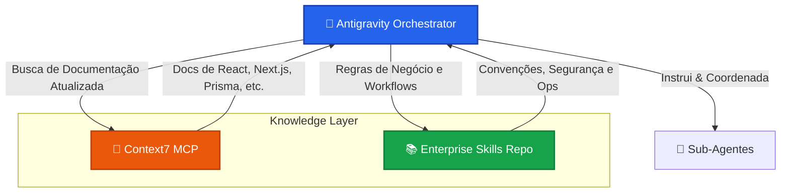

<div align="center">
  <h1>🚀 Enterprise SaaS Agentic Ecosystem</h1>
  <p><b>Advanced Skill Repository for Antigravity & AI Orchestrators</b></p>
  
  [](https://github.com/resper1965/skills)
  [](#)
  [](CATALOG.md)
  [](https://owasp.org)
</div>

<br />

Este repositório contém uma coleção curada e escalável de **Skills Agenticas de Nível Enterprise**, com 258 módulos focados em desenvolvimento, arquitetura, segurança e observabilidade para sistemas SaaS modernos.

Cada skill atua como um "livro de regras" que ensina os agentes de IA (como o **Antigravity**) convenções de código rigorosas, padrões arquiteturais e workflows específicos de segurança.

---

## 🏗️ Arquitetura do Ecossistema

O nosso ambiente agentico opera na interseção entre o orquestrador (Antigravity), o banco de conhecimentos em tempo real (Context7) e este repositório de skills.



### 🧠 A Importância do Context7 MCP
Este ecossistema possui uma **diretriz global estrita**: todas as consultas sobre bibliotecas, frameworks, SDKs e APIs (como React, Next.js, Prisma, Vercel) **devem obrigatoriamente** passar pelo **Context7 MCP**. 
- **Prevenção de Alucinações:** As LLMs não usam dados desatualizados do próprio treinamento.
- **Sempre Atualizado:** O Context7 faz o pull da documentação em tempo real, garantindo que as skills apliquem as sintaxes corretas da versão mais recente da ferramenta.

---

## 📚 Catálogo de Skills (258 Ativas)

Para manter este README limpo e performático, o catálogo completo de skills foi movido para um arquivo dedicado. 

> 👉 **[Acessar o Catálogo Completo de Skills (CATALOG.md)](CATALOG.md)**

Lá você encontrará a listagem alfabética de todas as 258 skills legadas e curadas, com suas respectivas descrições e links diretos. Este catálogo é gerado automaticamente pelo nosso script CI.

---

## ⚡ Instalação Rápida (Onboarding)

### Requisitos
- **Python 3.10+** instalado.
- Ambiente **Antigravity** configurado localmente.

### Como Sincronizar Tudo no seu Agente Local

1. Clone este repositório:
```bash
git clone https://github.com/resper1965/skills.git
cd skills
```

2. Execute o script de instalação para copiar e registrar todas as skills no seu ambiente:
```bash
python install.py --all
```

---

## 🛠️ Contribuindo e Regras (Quality Gate)

A adição de novas skills ou alteração de regras existentes deve seguir o padrão rigoroso de qualidade. O repositório possui validação automática (Quality Gates).

> 👉 **[Leia as Diretrizes de Contribuição (CONTRIBUTING.md)](CONTRIBUTING.md)**

Para ativar o hook de Git que impede commits de skills inválidas:
```bash
# Habilita o pre-commit hook
git config core.hooksPath .githooks
```
Toda vez que você rodar `git commit`, o validador verificará o YAML frontmatter e auditará os arquivos para evitar vazamento de segredos.
